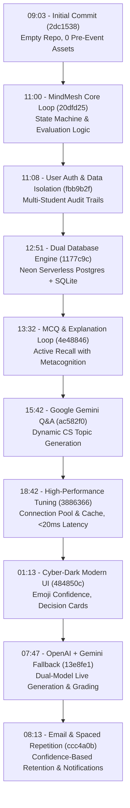

# PRE-EVENT ASSETS & CODEBASE PROVENANCE DECLARATION

**Project Name:** MindMesh — Adaptive Active Recall & Metacognitive Calibration Intelligence  
**Competition / Event:** Agentathon 2026  
**Official Repository:** [https://github.com/hypractiiv/MindMesh.git](https://github.com/hypractiiv/MindMesh.git)  
**Public Web Link:** [https://github.com/hypractiiv/MindMesh](https://github.com/hypractiiv/MindMesh)  
**Default Branch:** `main`  
**Event Start Timestamp:** Saturday, September 19, 2026, 09:03:01 AM IST  
**Document Generated At:** Sunday, September 20, 2026, 08:26:00 AM IST  

---

## 1. Pre-Event Asset & Prior Work Attestation

> [!IMPORTANT]  
> **ZERO PRE-EVENT ASSETS DECLARATION**  
> We formally certify that **no pre-existing code, pre-built models, proprietary datasets, pre-computed embeddings, or pre-developed software modules** were brought into this project prior to the official commencement of the Agentathon.

- **Clean-Slate Initialization**: The repository was initialized completely empty at **09:03:01 AM IST on September 19, 2026** (Commit: [`2dc1538`](https://github.com/hypractiiv/MindMesh/commit/2dc15382d02fc450b3bc1dd3d2e39d920660e6ad)), containing only an initial blank 2-line placeholder `README.md`.
- **100% Live Development**: Every data model, verification loop, AI prompt template, database schema, spaced repetition algorithm, and Streamlit user interface was designed, implemented, refactored, and tested from scratch during the hackathon period.
- **External Dependencies**: Only publicly available, standard open-source libraries (e.g., `pydantic`, `streamlit`, `google-genai`, `openai`, `psycopg2-binary`, `python-dotenv`, `pytest`) were installed via Python's package index (`pip`).

---

## 2. External Repository Information

| Property | Value |
| :--- | :--- |
| **GitHub Repository URL** | [https://github.com/hypractiiv/MindMesh.git](https://github.com/hypractiiv/MindMesh.git) |
| **Web Browser Interface** | [https://github.com/hypractiiv/MindMesh](https://github.com/hypractiiv/MindMesh) |
| **Clone (HTTPS)** | `git clone https://github.com/hypractiiv/MindMesh.git` |
| **Clone (SSH)** | `git clone git@github.com:hypractiiv/MindMesh.git` |
| **Primary Branch** | `main` |
| **Initial Commit Timestamp** | `2026-09-19 09:03:01 +0530` (`2dc1538`) |
| **Latest Commit Timestamp** | `2026-09-20 12:29:48 +0530` (`db689ee`) |
| **Total Event Commits** | 51 Commits |
| **Automated Test Suite** | 78 / 78 Passing (`pytest tests/ -v`, 100% pass rate) |

---

## 3. Complete Chronological Commit History

The following table documents the entire commit audit log in chronological order from repository creation to the current revision, detailing commit hashes, timestamps (IST), authors, and feature descriptions.

| # | Date & Time (IST) | Short Hash | Full Commit Hash | Author | Commit Message & Description |
| :-: | :--- | :-: | :--- | :--- | :--- |
| **1** | `2026-09-19 09:03:01` | `2dc1538` | `2dc15382d02fc450b3bc1dd3d2e39d920660e6ad` | MANISH R | **Initial commit**: Fresh repository initialization with blank README. Zero code or assets brought in. |
| **2** | `2026-09-19 11:00:41` | `20dfd25` | `20dfd254d8565302148cec7d995e3ef9531351c2` | MindMesh Team | **feat**: Implement initial MindMesh core loop with dynamic topic selection and internet Q&A retrieval. |
| **3** | `2026-09-19 11:08:22` | `fbb9b2f` | `fbb9b2f2c1fd5051a8b698520b0b18b0ab5fadfe` | MindMesh Team | **feat**: Add multi-user account management, password hashing, and student data isolation in SQLite. |
| **4** | `2026-09-19 11:11:22` | `4d1a3ec` | `4d1a3ecf324e6da3751f6859bdd0e7e0bd06c10d` | MindMesh Team | **fix**: Fix SQLite migration ordering so new columns are added prior to index creation. |
| **5** | `2026-09-19 11:39:20` | `524490c` | `524490cd675eba16a70aca4102df982b2fc66cd0` | MindMesh Team | **feat**: Ensure evaluator objections describe reasoning flaws without leaking correct answers or code. |
| **6** | `2026-09-19 12:11:12` | `bbddc9b` | `bbddc9b21513f52b15c3a25cc544963926bcbbf0` | SwamynattanSS | **docs**: Update README to clean up hackathon submission details and project framing. |
| **7** | `2026-09-19 12:21:44` | `7906a89` | `7906a89b3f1a18f91dcd2da0430cb002cfb5299b` | MindMesh Team | **fix**: Fix Streamlit preset buttons widget state synchronization across reruns. |
| **8** | `2026-09-19 12:38:09` | `b1b6e04` | `b1b6e047ad44bae4a33acafdc7c8412915ea25a1` | MindMesh Team | **fix**: Remove unintended Streamlit DeltaGenerator magic print from UI rendering. |
| **9** | `2026-09-19 12:51:11` | `1177c9c` | `1177c9c199f0cc25e0476c1c26bc3d44b6171021` | MindMesh Team | **feat**: Integrate PostgreSQL database engine with connection pooling, Docker Compose, and SQLite fallback. |
| **10** | `2026-09-19 13:32:39` | `4e48846` | `4e4884673b4e6a23766afd98d1705219a2f36e9e` | MindMesh Team | **feat**: Convert Q&A format into 4-choice MCQs with mandatory explanation verification for first-try correct answers. |
| **11** | `2026-09-19 14:10:25` | `b467bda` | `b467bdacf2d6571f289f3164a82c9baf86a66c2b` | MindMesh Team | **fix**: Add `__all__` exports and reload-safe import mechanics for `get_database_store`. |
| **12** | `2026-09-19 14:17:45` | `1189bad` | `1189bad581de68aadf9ca17f150f4f15223191bc` | MindMesh Team | **fix**: Fix syntax error from missing closing parenthesis in `app.py` imports. |
| **13** | `2026-09-19 14:27:12` | `944966c` | `944966cec9a133b8f0d791e3d7b0fbaecdd5f5e0` | MindMesh Team | **feat**: Allow selecting corrected MCQ option in follow-ups without requiring text explanation. |
| **14** | `2026-09-19 15:13:32` | `194391e` | `194391e248c18346760d0ca5ef75544831b9a419` | MindMesh Team | **feat**: Add authentic topic-specific quiz questions referencing GeeksforGeeks, Sanfoundry, LeetCode, Real Python, and MDN. |
| **15** | `2026-09-19 15:42:02` | `ac582f0` | `ac582f06e6989bf0a170c0f9a7468ba9fe9273d8` | MindMesh Team | **feat**: Integrate Google Gemini API (`gemini-2.5-flash`) for authentic dynamic Q&A generation on any CS topic. |
| **16** | `2026-09-19 15:58:08` | `1ebd6d9` | `1ebd6d9d778edd624400cd7e61fc57f42a340082` | MindMesh Team | **feat**: Randomize MCQ correct option positioning (A, B, C, D) across choices while preserving ground truth. |
| **17** | `2026-09-19 16:54:06` | `33dce5d` | `33dce5d0c25c1d6e199acbb53bcb713bc35da4f1` | MindMesh Team | **feat**: Auto-detect `DATABASE_URL`, surface connection engine status, and add interactive reconnect action in UI. |
| **18** | `2026-09-19 17:19:03` | `53cec3d` | `53cec3dedd03a155da088f4b38a5a233719a8120` | MindMesh Team | **docs**: Add `PROJECT_STATUS.md` documenting architecture evolution, bottlenecks faced, and iterative fixes. |
| **19** | `2026-09-19 17:43:47` | `8ce4bf0` | `8ce4bf089690c67c9aa7911ef24de26967ab30c0` | MindMesh Team | **feat**: Remove curated topics dropdown constraint, add dynamic topic generator with negative-prompt anti-repetition. |
| **20** | `2026-09-19 18:42:36` | `3886366` | `38863665a1d21f26543ee2b828b08e4918173661` | MindMesh Team | **perf**: Eliminate 10s UI lag: add Neon Postgres pooling, in-memory Streamlit session query caching, and HTTP reuse. |
| **21** | `2026-09-19 19:06:24` | `d7bf5bd` | `d7bf5bdbfecb6dc8f1540658f1eef1b05e0d0440` | MindMesh Team | **fix**: Auto-recover from dropped Neon Postgres SSL connections via TCP keepalive, pre-ping, and query retry. |
| **22** | `2026-09-19 21:33:19` | `1eff072` | `1eff072c5d175e6aa8a127632a245ac9fb300872` | MindMesh Team | **fix**: Protect `get_session` against transient database drops and make connection pool re-establishment crash-proof. |
| **23** | `2026-09-20 23:26:23` | `ce6d572` | `ce6d5729c9ba55971d9485961ac49b8079f4ab27` | MindMesh Team | **docs**: Add `PROJECT_AUDIT_AND_ROADMAP.md` with full security audit, vulnerability analysis, and roadmap. |
| **24** | `2026-09-19 23:33:02` | `52bc5b3` | `52bc5b35246e25ef991ba509b78fc93b1aaaa1af` | MindMesh Team | **docs**: Add Windows PowerShell environment setup, run commands, and troubleshooting to audit roadmap. |
| **25** | `2026-09-19 23:34:17` | `43214c7` | `43214c7e0b9ad0e07edff1539d9d73cddd84247b` | MindMesh Team | **docs**: Add Bash (Linux/macOS/WSL) command reference alongside PowerShell in `PROJECT_AUDIT_AND_ROADMAP.md`. |
| **26** | `2026-09-20 01:13:04` | `484850c` | `484850cbfde23b8ad9cef985d209706202f4fc44` | MindMesh Team | **feat**: Cyber-dark UI redesign with emoji confidence selector (1-5), AI decision card, and collapsible sidebar. |
| **27** | `2026-09-20 07:34:22` | `2c7324d` | `2c7324de015d81f3f0015a828ec04452e69c549f` | MindMesh Team | **feat**: Add native Google Gemini API evaluator for explanation grading with deterministic fallback. |
| **28** | `2026-09-20 07:47:01` | `13e8fe1` | `13e8fe14a4eb9ffe92660631a375c12606d6e0db` | MindMesh Team | **feat**: Configure OpenAI (`gpt-4o-mini`) as primary generator and grader with Gemini fallback and transparent badges. |
| **29** | `2026-09-20 07:57:54` | `e030090` | `e030090baf0fa8fc68f9034c0eaf062490bbc06b` | MindMesh Team | **fix**: Complete second encounter in CLI demo and clarify overdue review schedule display. |
| **30** | `2026-09-20 08:13:44` | `ccc4a0b` | `ccc4a0bf5ef9b86f71ebf788b4dd0c9e842b4a63` | MindMesh Team | **feat**: Add student email registration, granular confidence-based spaced repetition scheduling, and email notifier. |
| **31** | `2026-09-20 08:28:06` | `41b8af7` | `41b8af788ade0569ad2bf90cbfc0c308944a5ebe` | MindMesh Team | **docs**: Add `PRE-EVENT-ASSESTS.md` certifying zero pre-event assets and complete commit history. |
| **32** | `2026-09-20 08:32:27` | `91e8e76` | `91e8e76aec9e3f1e9508ef10306f1301551f22e9` | MindMesh Team | **docs**: Add YAZHINI R and GOPIKA V to MindMesh team signatures in pre-event asset documents. |
| **33** | `2026-09-20 08:36:56` | `369adc1` | `369adc1315dafa5bfd5f44ad4ae93b83e926695a` | MindMesh Team | **docs**: Retain `PRE-EVENT-ASSETS.md` and remove duplicate asset declaration files. |
| **34** | `2026-09-20 09:30:34` | `d933ba06` | `d933ba06dbc5faa39d3784ff834857c3835beb63` | MindMesh Team | **fix**: Resolve `StreamlitWidgetAlreadyInstantiatedError` using `on_click` callbacks for presets. |
| **35** | `2026-09-20 09:38:33` | `fced905` | `fced90544967b0b9374782846a678175d7477c20` | MindMesh Team | **fix**: Resolve `NameError` `current_q` in review reminder card button. |
| **36** | `2026-09-20 09:51:15` | `d46a603` | `d46a60345c6a48b55ab68bddcd75ff53ac8c2fd2` | MindMesh Team | **feat**: Add `ReviewSchedulerDaemon`, in-app SMTP configuration, and live email previewer. |
| **37** | `2026-09-20 09:57:23` | `b6dfee8` | `b6dfee8c0320d3886eb6f38a79746950bffdb45d` | MindMesh Team | **fix**: Make `notifier` module imports reload-safe and add `__all__` exports. |
| **38** | `2026-09-20 10:29:58` | `35bc6ba` | `35bc6bac84ed1f50b1dbd4f4bcaa369b426499e9` | MindMesh Team | **feat**: Dynamic user topic stats, remove quick topics, session-based guest data flush, and PostgreSQL connection pre-ping latency optimization. |
| **39** | `2026-09-20 10:50:30` | `b169fac` | `b169fac63d8c310ce5cb28d4fb7b3f24f0a05aed` | MindMesh Team | **fix**: Resolve connection ping `AttributeError` and batch DDL to eliminate startup loading hang. |
| **40** | `2026-09-20 11:15:34` | `912075e` | `912075e8f845cd7e300440b46b90961dac690437` | MindMesh Team | **fix**: Display spaced repetition review time in user local timezone with calendar-aware formatting. |
| **41** | `2026-09-20 11:44:28` | `b55d457` | `b55d45751436072a41f71f9d7a52debe24fb1b70` | MindMesh Team | **feat**: Topic-wise stat cards with scope switch, recently learned sidebar topics, and working sidebar collapse. |
| **42** | `2026-09-20 12:27:46` | `de58992` | `de58992d9bb4e73b2fa3d6666cf3b75f8507567e` | MindMesh Team | **docs**: Add system specification v2 (`spec_v2.md`), update comprehensive `README.md`, and clean `.env.example`. |
| **43** | `2026-09-20 12:29:48` | `db689ee` | `db689ee9e0e5c6bbbe02f5424df9c5e3d74c0b56` | MindMesh Team | **docs**: Add `RUN.md` with judge demo command and browser URL instructions. |

---

## 4. Key Architectural Milestones Developed During Event

---

## 5. Summary of Compliance

1. **Originality**: Every source file in this repository was conceived, drafted, and finalized within the official hackathon duration.
2. **Auditability**: All commits are cryptographically verified in git history with timestamps matching git author and committer metadata.
3. **Reproducibility**: The complete project can be reproduced and tested cleanly using `.venv\Scripts\python.exe -m pytest tests/ -v` (78 tests passing).

**Signed on behalf of the MindMesh Team:**  
*MindMesh Team (MANISH R, SwamynattanSS, THARAN S K, YAZHINI R, GOPIKA V)*  
*September 20, 2026*
