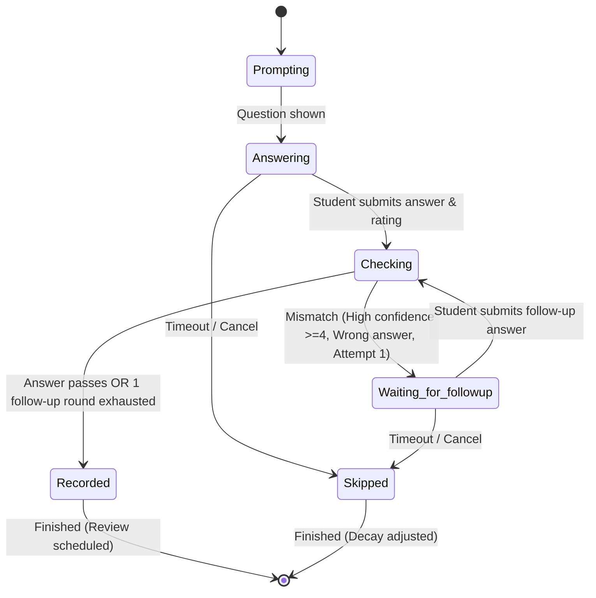

# MindMesh: Persistent Learning-Confidence Tracker

---

## 🎯 The MVP in One Sentence
> *"Detect a confident-but-wrong answer, ask a targeted question, wait for the human, resolve the attempt, and remember what happened next time."*

MindMesh is a persistent, single-concept learning-confidence tracker. It takes a student’s answer to a recursion base-case question plus a 1–5 self-rating, evaluates the answer, detects disagreement between confidence and correctness, asks one targeted follow-up question, and stores a persistent confidence record with a next-review date in SQLite.

---

## 🏗️ Architecture & Component Ownership

```
Student → UI/CLI → flow.py → steps.py → evaluate → llm.py/OpenRouter → Verdict → follow-up or record → store.py/SQLite → decay.py → next review
```

| Component | Purpose | Owner |
| :--- | :--- | :--- |
| **`flow.py`** | Six states and transition runner | Person 1 |
| **`models.py`** | Pydantic models: `Answer`, `Verdict`, `Question`, `ConceptRecord`, `SessionEvent` | Person 1 |
| **`store.py`** | Append-only SQLite persistence and crash resumption | Person 1 |
| **`steps.py`** | Step execution for prompt, answer, evaluate, follow-up, record | Person 2 |
| **`llm.py`** | Centralized, bounded model-call boundary (spend limit $\le 4$) | Person 2 |
| **`prompts/evaluate.md`** | Evaluator prompt with prompt-injection defense | Person 3 |
| **`concepts/recursion_base_case.py`** | Expected-pattern rules & 10 benchmark answers | Person 3 |
| **`tests/`** | 28 automated tests across reachability, persistence, restart, adversarial | Person 4 |
| **`cli.py` & `app.py`** | Automated 8-beat judge demo CLI & Streamlit presentation surface | Person 5 |
| **`docs/`** | System specification and demo scripts | Person 5 |

---

## 🔄 The Six-State Flow



- **Critical Transition**: `Checking` $\to$ `Waiting for follow-up` is triggered when a student provides a wrong answer with confidence $\ge 4/5$. The agent changes course rather than silently recording failure.
- **Revision Limit**: Strictly capped at 1 follow-up round based on stored answer records.

---

## 🚀 Quick Start

### 1. Setup Environment
```powershell
# Create & activate virtual environment (if not already active)
python -m venv .venv
.venv\Scripts\Activate.ps1

# Dependencies: pydantic, pytest, streamlit, httpx, python-dotenv
pip install -r requirements.txt # or pip install pydantic pytest streamlit httpx python-dotenv
```

### 2. Run All Automated Tests
```powershell
pytest tests/ -v
```
*Runs all 28 tests covering reachability, persistence, restart recovery, 10 benchmark answers, prompt injection defense, and spend limits.*

### 3. Run the 8-Beat Judge Demo (Automated CLI)
```powershell
python cli.py --demo
```

### 4. Launch the Streamlit Demo UI
```powershell
streamlit run app.py
```
- Features 1-click demo buttons for all beats (Wrong base case, corrected follow-up, second encounter).
- Real-time 6-state ribbon badge.
- Live SQLite audit log inspection.
- Debug time-travel fast-forward button.

---

## 🛡️ Security & Boundary Guarantees
- **Spend Limit**: Hard circuit breaker restricts model calls to at most 4 per concept-session.
- **Prompt Injection Defense**: Untrusted student submissions are wrapped within `<STUDENT_ANSWER>` tags; evaluated purely as data.
- **Resumability**: Interrupted sessions can be resumed from SQLite at any step without state loss.

---

## 🎤 Key Judge Questions & Answers

| Question | Answer |
| :--- | :--- |
| **Why is this agentic?** | Because the run persists state and can dynamically change its workflow: when `Checking` detects a confident-but-wrong answer, it takes an adaptive backward transition to ask a targeted question and pauses for the human, rather than proceeding down a static pipeline. |
| **Why not just trust the student's 4/5 rating?** | The system's core premise is that self-perception can disagree with demonstrated correctness. The evaluator checks the answer independently before deciding the workflow. |
| **Why only one concept?** | The scope intentionally proves the stateful agent loop before scaling. The state machine and persistence layers are completely concept-agnostic. |
| **Why doesn't the AI teach?** | Teaching is explicitly outside scope. The agent asks one targeted question to prompt reflection, keeping the human responsible for producing the correct answer. |
| **Why SQLite?** | SQLite provides lightweight, zero-dependency persistence that survives process exits and supports multi-encounter audit history. |
| **Why only one LLM call site?** | Centralizing calls in `llm.py` ensures strict spend caps, predictable retries, injection defenses, and easy swapping between fake and live models. |
